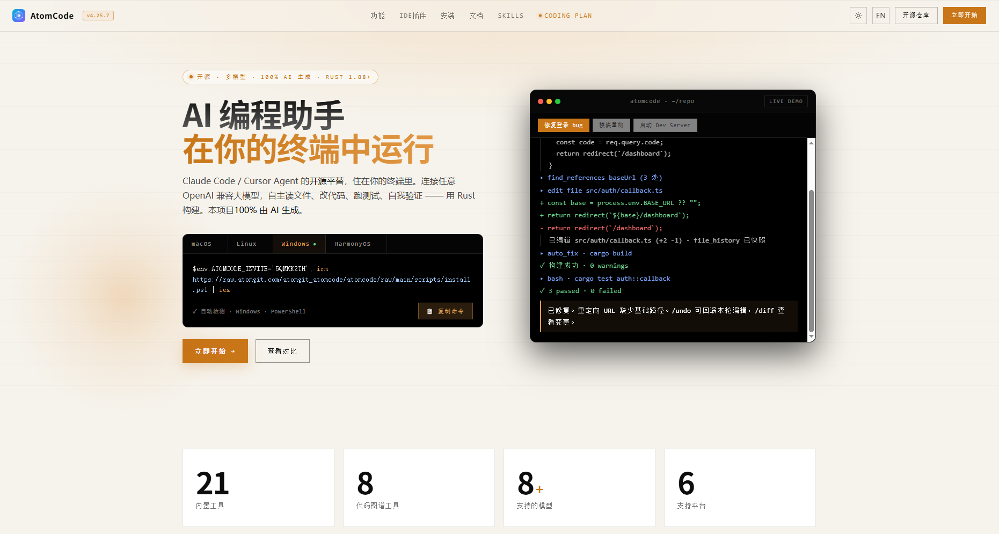
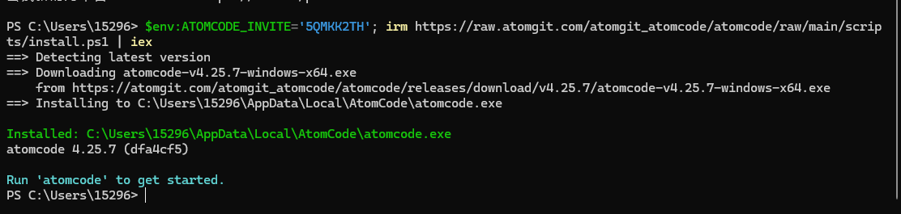
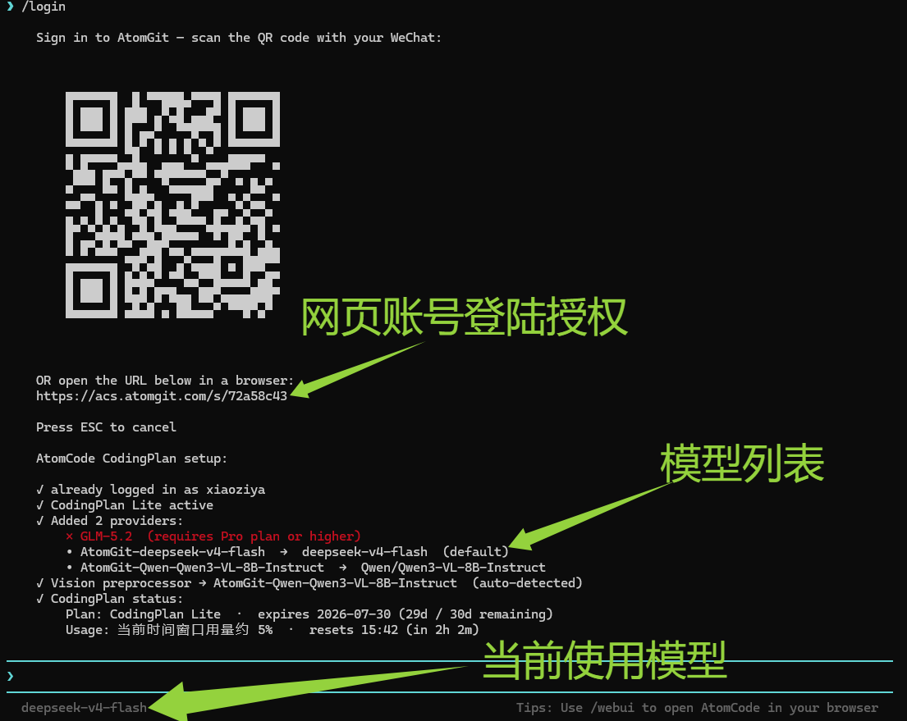
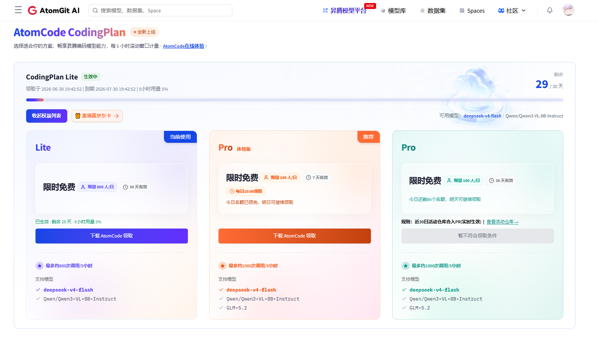
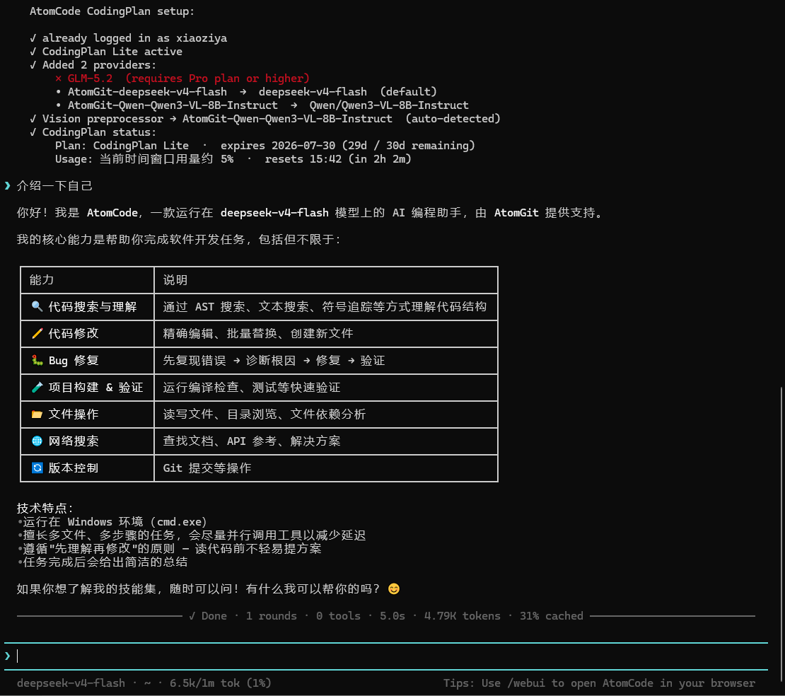

## 第一步：下载 AtomCode

AtomCode 下载链接：

  <code class="text-sm font-medium">https://atomcode.atomgit.com/invite/5QMKK2TH</code>
  <button onclick="navigator.clipboard.writeText('https://atomcode.atomgit.com/invite/5QMKK2TH');this.querySelectorAll('svg')[0].classList.add('hidden');this.querySelectorAll('svg')[1].classList.remove('hidden');setTimeout(()=>{this.querySelectorAll('svg')[0].classList.remove('hidden');this.querySelectorAll('svg')[1].classList.add('hidden')},1500)" class="shrink-0 w-7 h-7 flex items-center justify-center rounded-md bg-black/10 dark:bg-white/10 hover:opacity-80 transition-opacity cursor-pointer">
    <svg class="w-3.5 h-3.5" fill="none" stroke="currentColor" viewBox="0 0 24 24"><path stroke-linecap="round" stroke-linejoin="round" stroke-width="2" d="M8 16H6a2 2 0 01-2-2V6a2 2 0 012-2h8a2 2 0 012 2v2m-6 12h8a2 2 0 002-2v-8a2 2 0 00-2-2h-8a2 2 0 00-2 2v8a2 2 0 002 2z"/></svg>
    <svg class="w-3.5 h-3.5 hidden text-green-500" fill="none" stroke="currentColor" viewBox="0 0 24 24"><path stroke-linecap="round" stroke-linejoin="round" stroke-width="2" d="M5 13l4 4L19 7"/></svg>
  </button>

## 第二步：安装

打开 Windows PowerShell，粘贴以下命令运行：

  <button onclick="navigator.clipboard.writeText(`$env:ATOMCODE_INVITE='5QMKK2TH'; irm https://raw.atomgit.com/atomgit_atomcode/atomcode/raw/main/scripts/install.ps1 | iex`);this.querySelectorAll('svg')[0].classList.add('hidden');this.querySelectorAll('svg')[1].classList.remove('hidden');setTimeout(()=>{this.querySelectorAll('svg')[0].classList.remove('hidden');this.querySelectorAll('svg')[1].classList.add('hidden')},1500)" class="absolute top-2 right-2 w-7 h-7 flex items-center justify-center rounded-md bg-black/10 dark:bg-white/10 hover:opacity-80 transition-opacity cursor-pointer">
    <svg class="w-3.5 h-3.5" fill="none" stroke="currentColor" viewBox="0 0 24 24"><path stroke-linecap="round" stroke-linejoin="round" stroke-width="2" d="M8 16H6a2 2 0 01-2-2V6a2 2 0 012-2h8a2 2 0 012 2v2m-6 12h8a2 2 0 002-2v-8a2 2 0 00-2-2h-8a2 2 0 00-2 2v8a2 2 0 002 2z"/></svg>
    <svg class="w-3.5 h-3.5 hidden text-green-500" fill="none" stroke="currentColor" viewBox="0 0 24 24"><path stroke-linecap="round" stroke-linejoin="round" stroke-width="2" d="M5 13l4 4L19 7"/></svg>
  </button>
  <code class="text-sm">$env:ATOMCODE_INVITE='5QMKK2TH'; irm https://raw.atomgit.com/atomgit_atomcode/atomcode/raw/main/scripts/install.ps1 | iex</code>

## 第三步：使用

安装完成后，在终端输入 `atomcode` 回车，即可进入 AI 终端。

进入后输入 `/login` 命令，系统会弹出网页端授权页面，点击授权即可领取使用模型。

## 第四步：查看权益

打开 [https://ai.gitcode.com/serverless-api](https://ai.gitcode.com/serverless-api) 查看模型权益。权益分为 **Lite** 和 **Pro** 两个版本，大多数人领到的是 Lite 版和 Pro 体验版（Pro 门槛极高，无需关注），确认已领取即可。

## 第五步：开始对话

回到终端，直接输入问题即可与 AI 模型对话，支持 deepseek-v4-flash、GLM-5.2 等多种模型。

